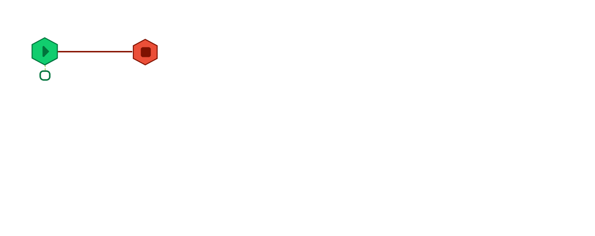
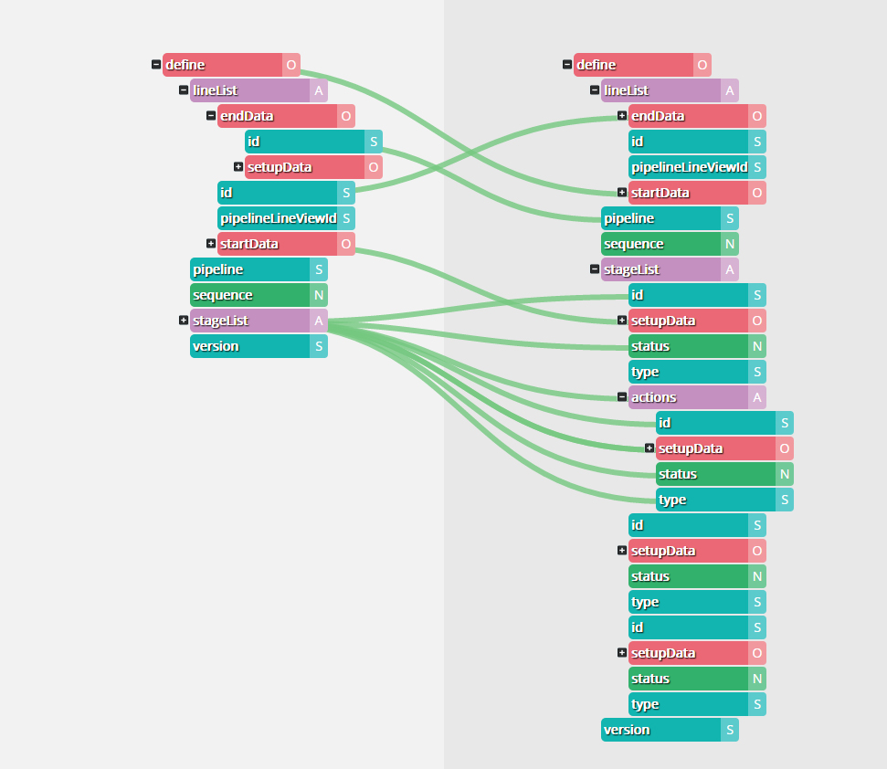
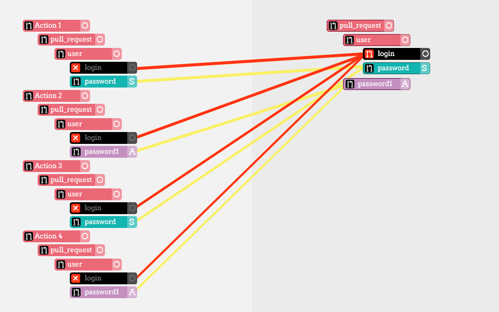

# ContainerOps - DevOps Orchestration

## What's ContainerOps?

> ContainerOps is a DevOps orchestration.

There is a lot of projects, plugins and services implemeted build, test and deployment in the DevOps workflow. But no one cover all tasks, we could only choose different projects and services together assembling into DevOps workflow. How to determine the order of tools and pass the data between them?  

ContainerOps is DevOps orchestration. It build a DevOps workflow orchestrating tools or services, and passing the trigger data or customize data from the workflow start trigger to the every stage. So don’t need abandon the original DevOps solution, just add ContainerOps as the top orchestration, scheduling the existing build system, continuous integration system or continuous deployment system, adding any features used and reused container DevOps component.
.



> Defining the DevOps component.

ContainerOps provide a specification about how encapsulate the DevOps task into a container. A DevOps task developed in any programming language like Bash, Golang, Python or C++ can be encapsulated as a containerized DevOps component. This guarantee that the DevOps task will always run the same, regardless of its environment.

> Drawing the DevOps Workflow.

The ContainerOps has a DevOps workflow WYSIWYG editor in the browser. The user could defining the DevOps workflow by drag or drop the line, or defining the data flow from workflow trigger to the end by the same way.





> DevOps With Container, DevOps For Container!

## Certificate of Origin

By contributing to this project you agree to the Developer Certificate of
Origin (DCO). This document was created by the Linux Kernel community and is a
simple statement that you, as a contributor, have the legal right to make the
contribution. 

```
Developer Certificate of Origin
Version 1.1

Copyright (C) 2004, 2006 The Linux Foundation and its contributors.
660 York Street, Suite 102,
San Francisco, CA 94110 USA

Everyone is permitted to copy and distribute verbatim copies of this
license document, but changing it is not allowed.

Developer's Certificate of Origin 1.1

By making a contribution to this project, I certify that:

(a) The contribution was created in whole or in part by me and I
    have the right to submit it under the open source license
    indicated in the file; or

(b) The contribution is based upon previous work that, to the best
    of my knowledge, is covered under an appropriate open source
    license and I have the right under that license to submit that
    work with modifications, whether created in whole or in part
    by me, under the same open source license (unless I am
    permitted to submit under a different license), as indicated
    in the file; or

(c) The contribution was provided directly to me by some other
    person who certified (a), (b) or (c) and I have not modified
    it.

(d) I understand and agree that this project and the contribution
    are public and that a record of the contribution (including all
    personal information I submit with it, including my sign-off) is
    maintained indefinitely and may be redistributed consistent with
    this project or the open source license(s) involved.
```

## Format of the Commit Message

You just add a line to every git commit message, like this:

    Signed-off-by: Meaglith Ma <maquanyi@huawei.com>

Use your real name (sorry, no pseudonyms or anonymous contributions.)

If you set your `user.name` and `user.email` git configs, you can sign your
commit automatically with `git commit -s`.

