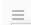

## Getting Start With ContainerOps

### System Setting
- __Open ContainerOps, click System Setting on the left,  input KUBE_APISERVER_IP, KUBE_NODE_IP, and then click Save__

| FIELD |  DESCRIPTION |
| -------- | -------- |
| KUBE_APISERVER_IP  | KUBERNETES APISERVER URL |
| KUBE_NODE_IP  | KUBERNETES SERVER IP |

### Component
- __Open ContainerOps, click Component  on the left, Click New button in the Component List on the right, input name, version, and then click Saved button return the Component List__

| FIELD |  DESCRIPTION |
| -------- | -------- |
| Name  | Component Name |
| Version  | Component Version |

- __In the Component List, Click View button you just created on the Component__

| FIELD |  DESCRIPTION |
| -------- | -------- |
| Base Config  | Base Config |
| Design  | Design Tree/Event |
| Env Setting  | Env Setting |
| Select Component Type  | Select Component Type |

- __Input Base Config info__

| FIELD |  DESCRIPTION |
| -------- | -------- |
| Component Timeout  | When a component runing time exceeds the Component TimeOut, this component will fail |
| External Data URI  | This used send data to component URI |
| Repository Name  | Doker image REPOSITORY |
| Image Tag  | Doker image TAG |
| CPU Limits| CPU Limits|
| CPU Requests| CPU Requests|
| Memory Limits| Memory Limits|
| Memory Requests| Memory Requests|
| Service Type| Include Cluster IP and Node Port|
| Port| Container Internal Port|
| Target Port| Target Port|
| Node Port|Service Type select Node Port, Node Port will exist|

- __Click Design, click Switch to design mode, click Add New Value button to add key, and then click  set the key type or remove this key in the Input Tree/Output Tree__

- __Click Design, click Switch to json mode, can check input/output, also directly enter JSON in the Input From Tree/Output From Tree, can use these  icon to take effect__

- __Click Env Setting, click Add Env, Input Key/Value, and click Save button__

| FIELD |  DESCRIPTION |
| -------- | -------- |
| Component Name  | Component Name |
| Component Timeout  | Component Timeout |
| End Point  | End Point|
| Image Tag  | Image Tag |
| Data From  | uri |
| CPU Limits  | CPU Limits  |
| CPU Requests  | CPU Requests|
| Memory Limits  | Memory Limits |
| Target Port  | Target Port|
| Node Port  | Node Port |

- __Save Component__

| FIELD |  DESCRIPTION |
| -------- | -------- |
| Save  | Save current component |
| Save As New Version  | Save As New Version component |

### Workflow

- __Click Workflow button on the left, Click New  button, input workflow name, version, click Save return the Workflow List__

| FIELD |  DESCRIPTION |
| -------- | -------- |
| Name  | Workflow Name |
| Version  | Workflow Version |

- __In the Workflow List, click View, will appear workflow details__

| FIELD |  DESCRIPTION |
| -------- | -------- |
| Workflow switch | OFF/ON |
| Check  | Check data |
| Save  | Save workflow or save workflow as new version|
| History  | can change history if this workflow runed |
| New Workflow  | create New Workflow |
| Env Setting  | create workflow Env Setting |

- __Click Add Stage on the workflow, click Stage, input Stage Name, Stage Timeout, also select one Stage and click Delete__

| FIELD |  DESCRIPTION |
| -------- | -------- |
| Stage Name | Stage Name |
| Stage timeout  | Stage timeout |

- __Click Stage on the workflow, click Add Action, click added action__

- __Click Use Component, select component, click Load add Component to Action, also search some component__

- __The Action will auto generate Action Value, can change some fields__

| FIELD |  DESCRIPTION |
| -------- | -------- |
| Action Name  | Action Name |
| Action Timeout  | Action Timeout |
| Repository Name  | docker image Repository|
| Image Tag  | docker image Tag |
| External Data URI | External Data URI |
| Kubernetes IP  | Kubernetes IP |
| Kubernetes API Service  | Kubernetes API Service |
| CPU Limits| CPU Limits|
| CPU Requests| CPU Requests|
| Memory Limits| Memory Limits|
| Memory Requests| Memory Requests|
| Service Type| Include Cluster IP and Node Port|
| Port| Container Internal Port|
| Target Port| Target Port|
| Node Port|Service Type select Node Port, Node Port will exist|

- __Click start stage, pre Action click mouse, move the mouse the next action, release the mouse, the action to action line will generate__

| FIELD |  DESCRIPTION |
| -------- | -------- |
| Workflow URL  | Workflow URL  |
| Workflow Token  | Workflow Token |
| Select Type  | Select Type|
| Event  | Event |

- __Click the line, the relation will generate if the key and type in Import as same as Output, also manual set relation, remove relation line__

| FIELD |  DESCRIPTION |
| -------- | -------- |
| KEY | String, Object, Number, Array, Boolean, Null|

- __Click Save-->Save,  save workflow__

- __Click Check will check the workflow__

- __The workflow check status is  available, switch workflow ON__

- __When git pull request or other request, the workflow will run__

### History

- __Click the History on the left, the Workflow history list will appear__

- __Select workflow, check workflow status, click module check stage/action log__
