## Getting Start With ContainerOps

### Create Component
- __Click New Component button, input component name, version__

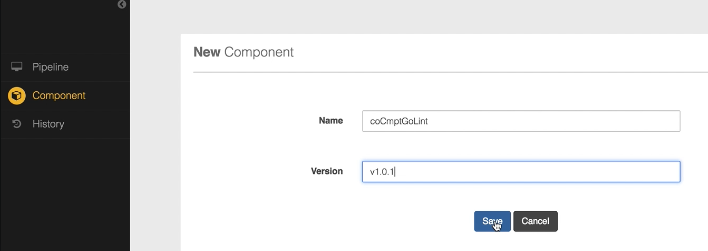

| FIELD |  DESCRIPTION |
| -------- | -------- |
| Name  | Component Name |
| Version  | Component Version |

- __Click View button__

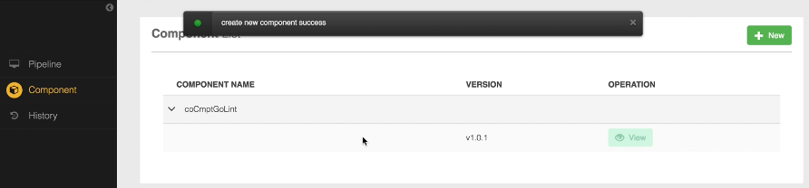

| FIELD |  DESCRIPTION |
| -------- | -------- |
| Base Config  | Base Config |
| Tree Edit  | Tree Edit |
| Event Edit  | Event Edit|
| Env Setting  | Env Setting |
| Select Component Type  | Select Component Type |

- __Input base config info__

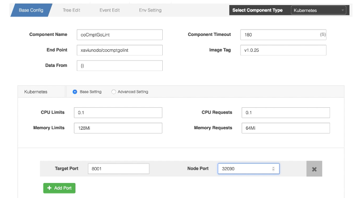

| FIELD |  DESCRIPTION |
| -------- | -------- |
| Component Name  | Component Name |
| Component Timeout  | Component Timeout |
| End Point  | End Point|
| Image Tag  | Image Tag |
| Data From  | uri |
| CPU Limits  | CPU Limits  |
| CPU Requests  | CPU Requests|
| Memory Limits  | Memory Limits |
| Target Port  | Target Port|
| Node Port  | Node Port |

- __Tree Edit__

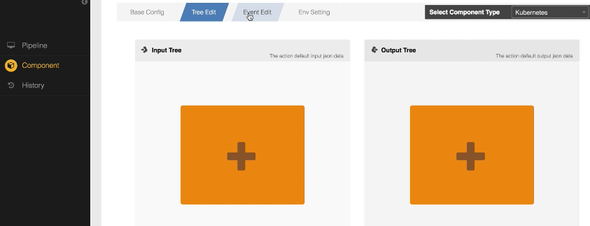

| FIELD |  DESCRIPTION |
| -------- | -------- |
| Input Tree  | Input Tree  |
| Output Tree  | Output Tree |

- __Event Edit__

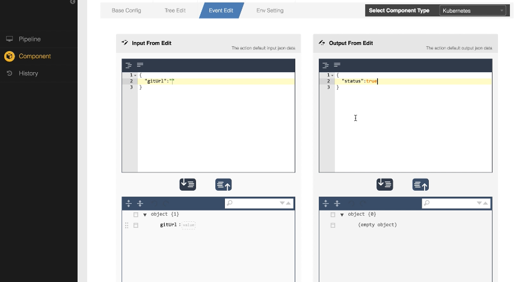

| FIELD |  DESCRIPTION |
| -------- | -------- |
| Component Name  | Component Name |
| Component Timeout  | Component Timeout |
| End Point  | End Point|
| Image Tag  | Image Tag |
| Data From  | uri |
| CPU Limits  | CPU Limits  |
| CPU Requests  | CPU Requests|
| Memory Limits  | Memory Limits |
| Target Port  | Target Port|
| Node Port  | Node Port |

- __Save Component__

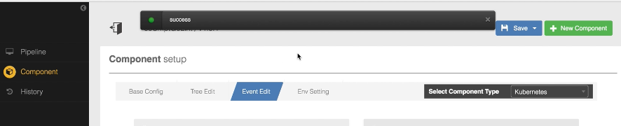

| FIELD |  DESCRIPTION |
| -------- | -------- |
| Save  | Save |
| Save As New Version  | Save As New Version |

### Create Workflow
- __Click New Workflow button, input workflow name, version__

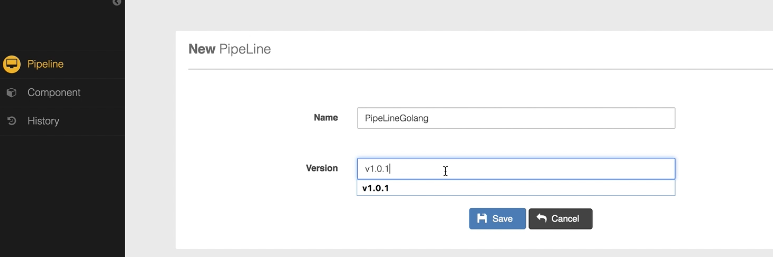

| FIELD |  DESCRIPTION |
| -------- | -------- |
| Name  | Workflow Name |
| Version  | Workflow Version |

- __View workflow__

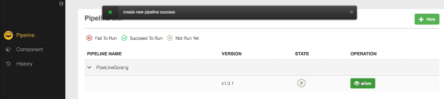

| FIELD |  DESCRIPTION |
| -------- | -------- |
| Workflow switch | OFF/ON |
| Check  | Save |
| Save  | Event Edit|
| Log History  | Log History |
| New Workflow  | New Workflow |
| Env Setting  | Env Setting |

- __Add  Workflow__

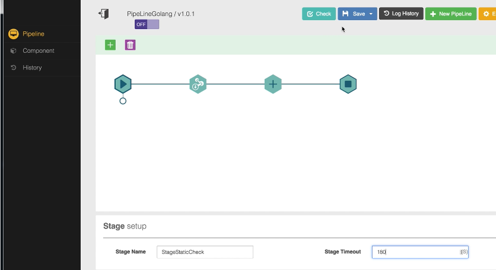

| FIELD |  DESCRIPTION |
| -------- | -------- |
| Stage Name | Stage Name |
| Stage timeout  | Stage timeout |

- __Add Action__

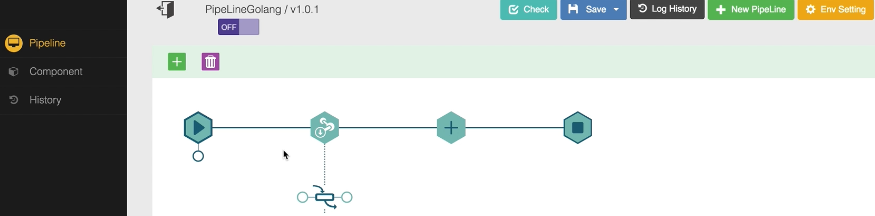

- __Add Component to Action__

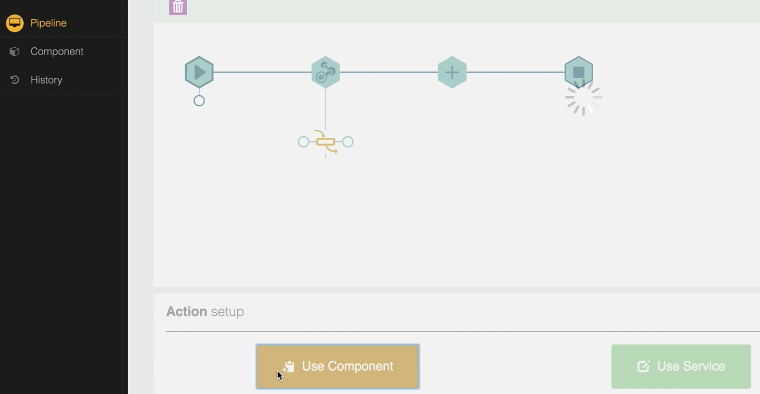

- __Load Component to Action__

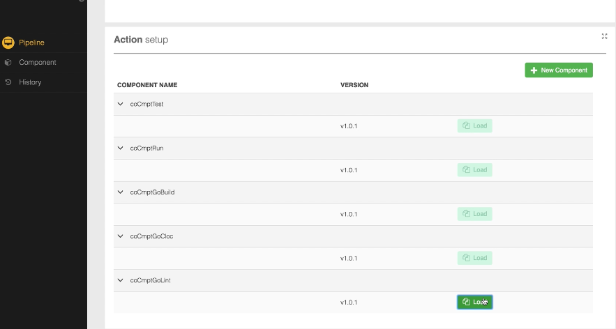

- __Set Action Value__

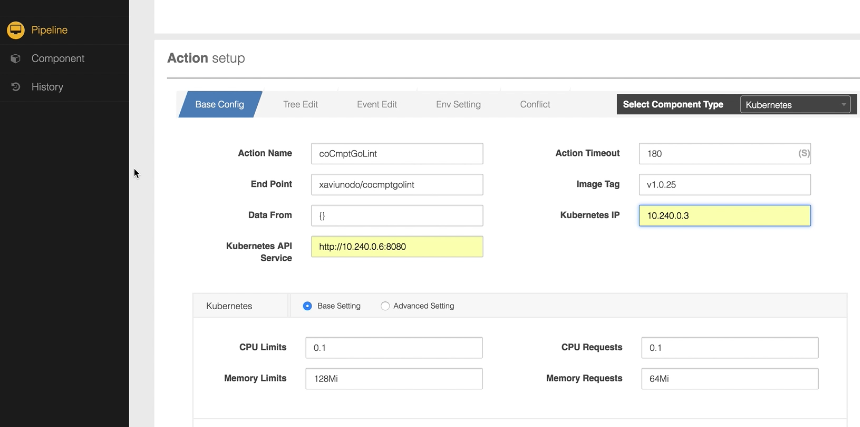

| FIELD |  DESCRIPTION |
| -------- | -------- |
| Component Name  | Component Name |
| Component Timeout  | Component Timeout |
| End Point  | End Point|
| Image Tag  | Image Tag |
| Data From  | uri |
| Kubernetes IP  | Kubernetes IP |
| Kubernetes API Service  | Kubernetes API Service |
| CPU Limits  | CPU Limits  |
| CPU Requests  | CPU Requests|
| Memory Limits  | Memory Limits |
| Target Port  | Target Port|
| Node Port  | Node Port |

- __Set Action relation__

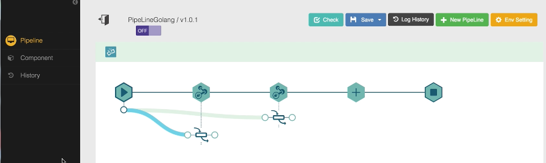

- __Set start stage__

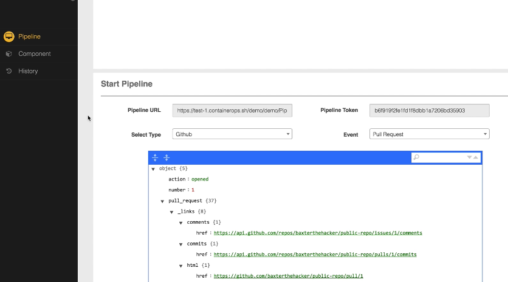

| FIELD |  DESCRIPTION |
| -------- | -------- |
| Workflow URL  | Workflow URL  |
| Workflow Token  | Workflow Token |
| Select Type  | Select Type|
| Event  | Event |

- __Set maual Action relation__

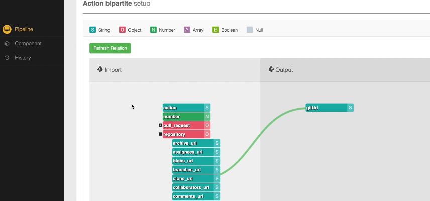

- __Set save workflow relation__

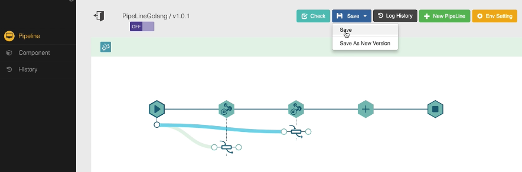

- __Open switch workflow__

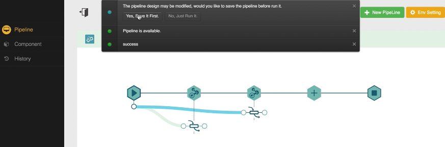

- __Open switch workflow__

### History

- __Workflow history list__

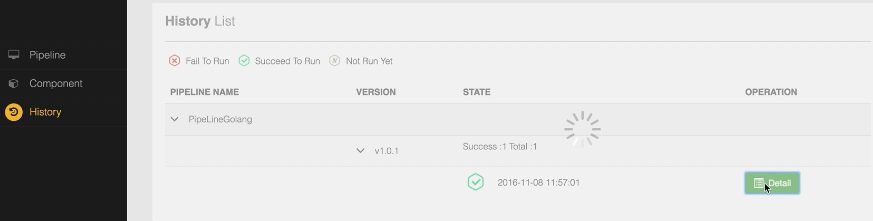

- __Workflow Action history__

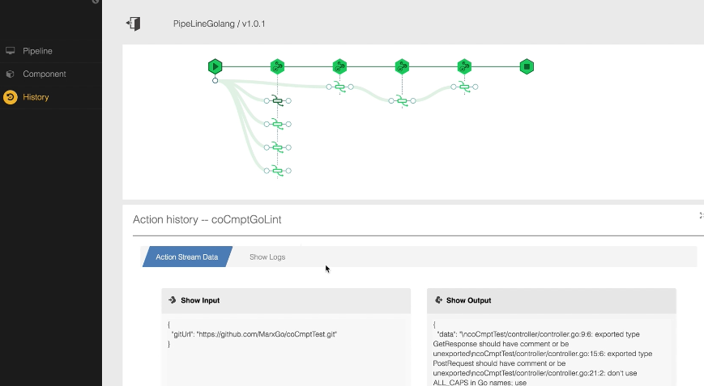

- __Workflow Action history__

